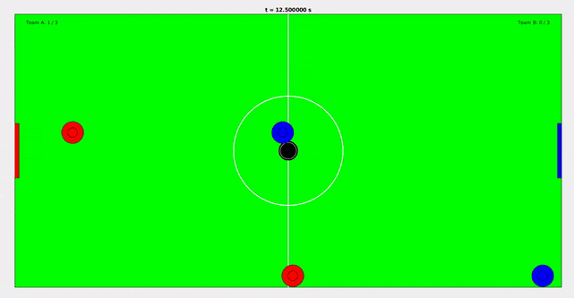

# Robo Game Sim



A minigame resembling multi-player air hockey for testing and developing optimal control and reinforcement learning algorithms.

## Dependencies

  * (CMake, C++ build tools, etc.)
  * libeigen3-dev

## Installation

To build the repository, execute the following

```bash
git clone --recurse-submodules https://github.com/goromal/robo-game-sim.git
cd robo-game-sim/py
cmake ..
make
```

## Usage

To run the sim and view the results, run the matlab script *matlab/visualize\_game.m*. 

**More functionality coming soon!**
